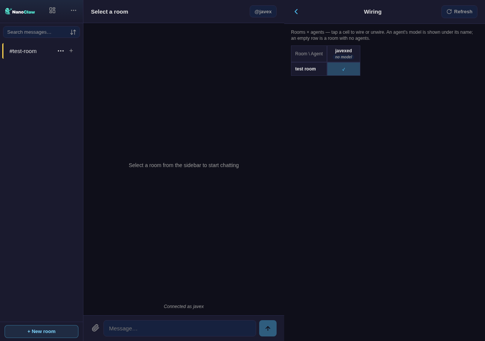

<!--
  DRAFT — seeds the standalone `nanoclaw-webchat` showcase repo.
  Screenshots referenced below go in ./screenshots/ (capture from a live install).
  Replace OWNER/REPO + image paths when the repo is created. Nothing here is
  published until you say so.
-->

# NanoClaw Webchat

[](#status--how-it-ships)
[](./LICENSE)
[](#)

**A local-first chat desk for your [NanoClaw](https://github.com/nanocoai/nanoclaw) agents** — multi-agent rooms, per-room threads, per-member billing, local-model routing, and a full operator console, in one installable PWA that binds to `127.0.0.1`.

Not Slack. Not a hosted widget. Your agents, your keys, your machine.

<!--  -->
> _Hero screenshot here (lobby + thread sidebar)._

---

## Why this exists

NanoClaw runs multiple AI agents with real tools and persistent workspaces. To actually *use* them you want a chat surface that:

- **stays local** — binds to `127.0.0.1`, secret injected by the host; reach it over your LAN or [Tailscale](#authentication), never a public endpoint you didn't choose;
- **routes to the right agent** — `@mention` in a shared lobby, or a dedicated DM;
- **keeps topics separate** — per-room **threads**, each its own isolated agent conversation;
- **bills honestly in a team** — each member can connect **their own** API key or Claude subscription (**BYOK**) so their turns bill to their own account;
- **doubles as an operator console** — create/wire agents, register models, manage roles and approvals, all from the browser.

It flows through NanoClaw's normal router and session model — it's a **channel adapter**, not a side process.

## Screenshots

| Multi-agent lobby + threads | Per-agent DM |
|---|---|
| <!---->_lobby.png_ | <!---->_dm.png_ |

| Models tab (Anthropic / Ollama / OpenAI-compatible) | Approvals inbox |
|---|---|
| <!---->_models.png_ | <!---->_approvals.png_ |

| Permissions & roles | Wiring matrix |
|---|---|
| <!---->_permissions.png_ | <!---->_wiring.png_ |

## Features

### Chat
| | |
|---|---|
| **Multi-agent lobby** | Shared room; route with `@agent` mentions. Engage modes (`mention-only` / `broadcast`) and a "prime" catch-all agent per room. |
| **Per-agent DMs** | A direct 1:1 room per agent. |
| **Per-room threads** | Several isolated conversations per room — each thread is its own agent session (own context, own memory). Sidebar-nested, per-thread unread, create/rename/delete. _(in review — PR for the `channels-webchat` branch)_ |
| **Auto-spawn threads** | Mention one agent in a multi-agent room → offered a dedicated thread for it (confirm-first; never moves a message). |
| **Markdown** | GFM, code blocks with copy, `@mention` highlighting, link/image rendering. |
| **Attachments** | Drag-and-drop; chunked/resumable uploads for large files; inline image/PDF/CSV/code preview. |
| **Live agent activity** | A "thinking" bubble with the agent's tool/progress/reasoning feed and turn-scoped liveness. |
| **Search** | Full-text (FTS5) across the rooms you can see. |
| **Notifications** | Installable PWA with push (web-push / VAPID); light / dark / system theme. |

### Security & identity
| | |
|---|---|
| **Localhost-first** | Binds `127.0.0.1` by default; refuses to start on a public interface without an explicit auth method. |
| **Authentication** | Tailscale identity · bearer token · SSO / reverse-proxy headers (Entra ID, Cloudflare Access…) · localhost. |
| **Roles** | Owner / admin, global or scoped to an agent group; per-room access gating; CSRF on every mutation. |
| **BYOK (per-member credentials)** | In a shared room, each member connects **their own** Anthropic API key **or** Claude subscription — their turns run on a container bearing their own credential identity, so nothing is shared or replayable. _(opt-in companion skill)_ |

### Operator console
| | |
|---|---|
| **Agents** | Create, wire to rooms, and draft new agents from a prompt — in the browser. |
| **Models** | Register Anthropic / Ollama / OpenAI-compatible models with live discovery (SSRF-guarded), assign per agent, applied via settings — no restart. |
| **Local-model routing** | Score each turn and route the simple ones to a local model (Ollama) while keeping a frontier model for the hard/tool-using ones — shadow-mode telemetry first, then opt-in live cascade. _(companion skill)_ |
| **Approvals** | Interactive approve/reject inbox for credentialed actions and agent requests. |
| **Permissions** | Manage users, roles, and members. |
| **Topology / Wiring** | See and edit which agents and models are reachable from which rooms. |

> Several of these (BYOK, local-routing) ship as **opt-in companion skills** layered on the same branch.

## Quick install

Requires a working **NanoClaw fork** (Node 22, pnpm) and at least one connected model.

```bash
# From inside your NanoClaw checkout:
bash <(curl -fsSL https://raw.githubusercontent.com/OWNER/REPO/channels-webchat/install-webchat.sh)
bash configure-webchat.sh          # auth, TLS, push (VAPID)
# rebuild + restart the host, then open:
#   http://127.0.0.1:3100
```

The installer is **idempotent** and **reversible** (`uninstall-webchat.sh`): it copies the webchat-owned files in wholesale and applies the small core-file hooks as guarded 3-way patches, verifies the native SQLite binding, and builds. Or drive it from Claude Code with the `/add-webchat` skill.

### Authentication at a glance
| Method | Set | For |
|---|---|---|
| Localhost | _(default)_ | single user on the same machine |
| Tailscale | `WEBCHAT_TAILSCALE=true` | reach it from your devices over your tailnet |
| Bearer token | `WEBCHAT_TOKEN=…` | a shared secret (generated by `configure-webchat.sh`) |
| SSO / reverse proxy | `WEBCHAT_TRUSTED_PROXY_IPS=…` | Entra ID, Cloudflare Access, etc. |

## Status & how it ships

NanoClaw Webchat is a **large, opt-in channel** that lives on the long-running **`channels-webchat`** branch of a NanoClaw fork and installs additively — it is deliberately **not merged into NanoClaw upstream** (too large a surface for core). This repo is its **front door**: docs, screenshots, and the installer. The code's source of truth stays on the branch.

You still need a working NanoClaw fork — **this is not NanoClaw itself**.

## How it's built

- A vanilla-JS **PWA** (`public/webchat/`) served statically — no build step, installable, offline-capable.
- A channel **adapter** (`src/channels/webchat/`) that registers with NanoClaw's router; messages flow through the normal session model, not a side channel.
- History in the host's central SQLite DB; credentials injected per-request by the OneCLI gateway (none in env or chat).

## License

MIT.
