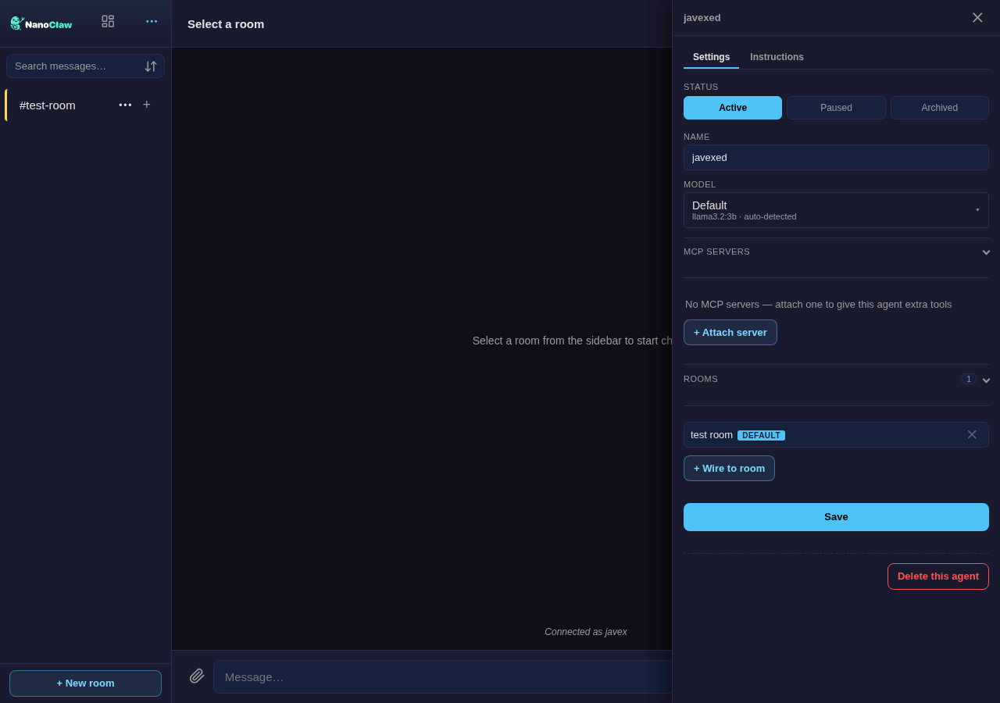

<!--
  DRAFT — seeds the standalone `webchat` showcase repo.
  Screenshots referenced below go in ./screenshots/ (capture from a live install).
  Replace OWNER/REPO + image paths when the repo is created. Nothing here is
  published until you say so.
-->

# NanoClaw Webchat

[](#status--how-it-ships)
[](./LICENSE)
[](#)

**A local-first chat desk for your [NanoClaw](https://github.com/nanocoai/nanoclaw) agents** — multi-agent rooms, per-room threads, per-member credentials, local-model routing, and a full operator console, in one installable PWA that binds to `127.0.0.1`.

Not Slack. Not a hosted widget. Your agents, your keys, your machine.

**→ [Full feature guide](./webchat-guide.md)** — getting started + a screenshot tour of every component.

<!--  -->
> _Hero screenshot here (lobby + thread sidebar)._

---

## Why this exists

NanoClaw runs multiple AI agents with real tools and persistent workspaces. To actually *use* them you want a chat surface that:

- **stays local** — binds to `127.0.0.1`, credentials injected per-request by the host; reach it over your LAN or [Tailscale](#authentication-at-a-glance), never a public endpoint you didn't choose;
- **routes to the right agent** — `@mention` in a shared lobby, or a dedicated DM;
- **keeps topics separate** — per-room **threads**, each its own isolated agent session;
- **lets a team bring their own keys** — each member can connect **their own** Anthropic API key so their turns run under their own credential identity (**BYOK**);
- **doubles as an operator console** — create/wire agents, register models, manage roles and approvals, all from the browser.

It flows through NanoClaw's normal router and session model — it's a **channel adapter**, not a side process.

## Screenshots

Real shots from a live install — the redesigned agent panel and the routing console:

| Agent settings — Settings / Instructions tabs | Routing console — Rules + classify bench |
|---|---|
|  |  |

_The hero lobby GIF and the DM / approvals / permissions / wiring shots come from a **populated** demo install — see [screenshots/CAPTURE.md](./screenshots/CAPTURE.md)._

## Features

### Chat
| | |
|---|---|
| **Multi-agent lobby** | Shared room; route with `@agent` mentions. Rooms are mention-only, with an optional **"prime"** catch-all agent and a per-room engage mode. |
| **Per-agent DMs** | A direct 1:1 room per agent. |
| **Per-room threads** | Several isolated conversations per room — each thread is its own agent session (own context, own memory). Sidebar-nested tree, per-thread unread, `main` pinned, create/rename/delete. |
| **Thread context sync** | Pull or push a verbatim, incremental slice of one thread's history into another — additive, with high-water marks so re-syncs don't duplicate. |
| **Markdown** | GFM via `marked` + `DOMPurify`, code blocks with copy, `@mention` highlighting, link/image rendering. |
| **Attachments** | Drag-and-drop; chunked/resumable uploads for large files; inline image preview + pinch-zoom lightbox. |
| **Live agent activity** | A "thinking" bubble streaming the agent's tool/progress/reasoning feed with a turn timer — and an **interrupt** button. |
| **Search** | Full-text (SQLite **FTS5**) with snippet highlighting, across the rooms you can see. |
| **Rooms management** | Pin, archive, hide, drag-reorder; per-room color. |
| **Notifications** | Installable **PWA** with Web Push (VAPID), offline shell via service worker, unread app-badge; light / dark / system theme. |

### Security & identity
| | |
|---|---|
| **Localhost-first** | Binds `127.0.0.1:3100` by default; refuses to bind a public interface unless an explicit auth method is configured. |
| **Authentication** | Localhost · Tailscale identity · bearer token · SSO / reverse-proxy headers (Entra ID, Cloudflare Access…). Each method auto-enables from its env var; no mode switch. |
| **Roles** | Owner / admin, global or scoped to an agent group; per-room access gating. |
| **Hardening** | `X-Webchat-CSRF` header required on mutations, same-origin CORS, strict CSP; **SSRF guards** on every operator-supplied URL; secret **redaction** on every broadcast and push payload; optional TLS. |
| **BYOK (per-member credentials)** | In a shared room, each member connects **their own** Anthropic API key; their turns run in a container bearing their own OneCLI credential identity — nothing shared or replayable. Keys go straight to the OneCLI vault, never the host. _(Claude-subscription / Codex OAuth minting is an early prototype; the API-key path is the shipping one.)_ |

### Operator console
| | |
|---|---|
| **Agents** | Create, wire to rooms, edit instructions, set status, assign a model, attach MCP servers — and **draft a new agent from a prompt** (host-side, via OneCLI). The settings panel splits into a **Settings** tab (status pills, model picker, a shared MCP/Rooms attach picker) and an **Instructions** tab. |
| **Models** | Register Anthropic / Ollama / OpenAI-compatible models with live discovery + probe (SSRF-guarded), assign per agent (written to the group's settings; containers pick it up on their next spawn). |
| **Ollama hosts** | Manage Ollama endpoints, stream model **pulls** with progress, refresh the router roster. |
| **Local-model routing** | A **"Set up routing"** button installs and configures the whole stack in one click — pulls the Arch-Router classifier (progress bar), scaffolds routing, auto-binds routes. Then the **Routing tab** (Rules / Logs sub-tabs) gives a routes editor, a live **test bench**, a **decisions tail**, and shadow-vs-live **metrics**: score each turn and send the simple ones to a local model while keeping a frontier model for the hard ones. Starts in shadow mode. |
| **Approvals** | Interactive approve/reject inbox for credentialed actions, in-room and in a per-approver DM inbox. |
| **Permissions** | Manage users, roles, and members. |
| **Topology / Wiring** | See and edit which agents and models are reachable from which rooms. |

> BYOK ships in the box (Anthropic API-key path). The **local-routing engine** (LiteLLM + Arch-Router classifier) installs right from the console's **"Set up routing"** button — or via the `/add-litellm` + `/add-routing` skills; the console degrades to "not installed" until it's there.

## Install

You need a working **NanoClaw fork** (Node + pnpm) with at least one connected model. **This is not NanoClaw itself** — it's a channel you add to your fork. The webchat code's source of truth is the long-running **`channels-webchat`** branch; this repo is its front door.

**From Claude Code (recommended)** — run the skill in your fork:

```
/add-webchat
```

It drives the installer end to end (fetch the branch, copy files, patch the core hooks, install deps, build).

**From a shell** — the installer lives on the branch; run it from inside your fork:

```bash
git fetch origin channels-webchat
git show origin/channels-webchat:install-webchat.sh | bash   # idempotent
bash configure-webchat.sh                                    # auth, TLS, Web Push (VAPID)
# restart the host, then open  http://127.0.0.1:3100
```

The installer copies the webchat-owned files in wholesale and applies the small core-file hooks as **reversible 3-way patches**, verifies the native SQLite binding, installs pinned deps, and builds. Undo it any time with `uninstall-webchat.sh`.

### Authentication at a glance
| Method | Set | For |
|---|---|---|
| Localhost | _(default)_ | single user on the same machine |
| Tailscale | `WEBCHAT_TAILSCALE=true` | reach it from your devices over your tailnet |
| Bearer token | `WEBCHAT_TOKEN=…` (≥24 chars) | a shared secret (generated by `configure-webchat.sh`) |
| SSO / reverse proxy | `WEBCHAT_TRUSTED_PROXY_IPS=…` (+ `WEBCHAT_TRUSTED_PROXY_HEADER`) | Entra ID, Cloudflare Access, etc. |

Localhost auto-owner is disabled the moment any explicit method is configured.

## Status & how it ships

NanoClaw Webchat is a **large, opt-in channel** that lives on the long-running **`channels-webchat`** branch of a NanoClaw fork and installs additively — it is deliberately **not merged into NanoClaw upstream** (too large a surface for core). This repo is its **front door**: docs, screenshots, and a pointer to the installer. The code stays on the branch.

You still need a working NanoClaw fork — **this is not NanoClaw itself**.

## How it's built

- A vanilla-JS **PWA** (`public/webchat/`) served statically — no build step, installable, offline-capable.
- A channel **adapter** (`src/channels/webchat/`) that registers with NanoClaw's router; messages flow through the normal session model, not a side channel.
- History in a webchat-owned set of tables in the host's central SQLite DB; credentials injected per-request by the OneCLI gateway (none in env or chat).

See **[docs/webchat/webchat.md](./webchat.md)** for the full architecture and feature reference.

## License

MIT.
